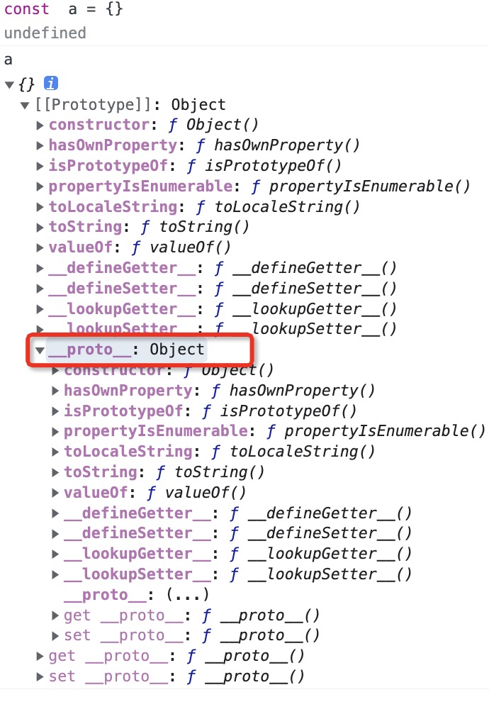

JavaScript是基于原型实现继承的，即使在ES2015/ES6中引入了class关键字，但本质上只是语法糖，JavaScript还是基于原型实现继承的。

### 原型链

图中的a对象是一个对象实例，它有一个私有属性名为__proto__，指向其构造函数的原型对象prototype，该原型对象也有一个自己的原型对象__proto__，层层向上直到原型对象的值为null，JavaScrip 中的对象都是位于原型链顶端的Object的实例。

### 构造函数、原型对象、对象实例3者的关系

来看一段示例代码

```
function Obj() {
    this.name = 'obj';
}
const obj = new Obj();
obj.constructor === Obj;  //true
obj.__proto__ === Obj.prototype;  // true

Obj.prototype.constructor === Obj; //true

Object.getPrototypeOf(obj) === obj.__proto__

```
函数Obj是构造函数，obj则是函数实例，从示例代码的执行结果可以得出几个结论
- 对象实例的constructor属性指向构造函数Obj
- 对象实例的__proto__和构造函数的prototype属性值一样都指向其原型对象
- 构造函数的原型对象的的构造函数指向Obj
- obj对象有一个[[Prototype]]属性，可以通过Object.getPrototypeOf(obj)访问到，它的值和obj.__proto__相同
  
### 基于原型链的继承

看一个例子

```

function Obj() {
  this.name = 'object';
}
Obj.prototype.props = 'test'
const obj = new Obj();
obj.self = 'own props'
obj.self //own props
obj.name;  // object
obj.props; // test
obj.unknow //undefined

```

我们定义了一个构造函数，然后给函数的原型对象定义了一个名为props的属性，同时给对象实例自身定义了一个self属性，当我们访问obj.self时，返回的是对象自身的属性，当我们访问props属性时，在对象实例本身上没有找到这个属性，那么他就会访问obj.__proto__属性看是否存在props属性，在我们的实例中，obj.__proto__上存在props属性，所以会返回test，如果obj.__proto__上也不存在该属性，则会沿着原型链一直找到Object，最后发现Object上没有该属性并且其__proto__指向null，则该值返回了undefined

### 参考文档

- [继承与原型链](https://developer.mozilla.org/zh-CN/docs/Web/JavaScript/Inheritance_and_the_prototype_chain)
