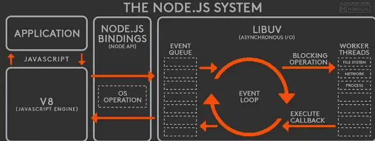

NodeJS事件循环和浏览器的事件循环机制有所不同，在讲解之前需要先铺垫一点别的知识。

#### 异步I/O
I/O指的是操作系统提供的IO(数据进出)的能力，比如键盘输入，显示器上会有专门的数据输出接口，这个接口向下会进入到操作系统这个层面，操作系统系统会提供诸多的I/Od的能力，比如磁盘读写，DNS查询、数据库连接，网络请求等。

I/O我们可以看做是上层应用与下层系统之间的数据交互，上层依赖于下层，上层也可以对下层提供的能力进行改造，根据起是否异步阻塞可分为异步非阻塞的异步I/O模型和同步阻塞的同步I/O模型。距离NodeJS的readFile
就是一个异步非阻塞的接口，而readFileSync就是一个同步阻塞接口。

#### NodeJS架构



此图是NodeJS架构，NodeJS被分为四层，分别是应用层、V8引擎层、NodeJS API层和libuv层。

- 应用层： 即JavaScript交互层，常见的就是NodeJS的模块，比如http,fs
- V8引擎层：用V8引擎来解析JavaScript语法，进而和下层API交互
- Node API层：为上层模块提供系统调用，一般由C语言实现，和操作系统交互
- libuv层： 是跨平台的底层封装，实现了事件循环、文件操作等，是NodeJS实现异步的核心

#### 事件循环

NodeJS执行非阻塞I/O操作，尽管JavaScript是单线程的，由于大多数内核是多线程的，NodeJs会尽可能将操作装载到系统内核。因此可以处理在后台执行的多个操作，当其一个操作完成时，内核会通知NodeJS，以便Node.js可以将相应的回调添加到轮询队列中以最终执行。

NodeJS启动启动时会初始化event loop，每一个event loop会包含6个循环阶段

```
   ┌───────────────────────┐
┌─>│        timers         │
│  └──────────┬────────────┘
│  ┌──────────┴────────────┐
│  │     I/O callbacks     │
│  └──────────┬────────────┘
│  ┌──────────┴────────────┐
│  │     idle, prepare     │
│  └──────────┬────────────┘      ┌───────────────┐
│  ┌──────────┴────────────┐      │   incoming:   │
│  │         poll          │<─────┤  connections, │
│  └──────────┬────────────┘      │   data, etc.  │
│  ┌──────────┴────────────┐      └───────────────┘
│  │        check          │
│  └──────────┬────────────┘
│  ┌──────────┴────────────┐
└──┤    close callbacks    │
   └───────────────────────┘
```
下面详细说一下几个阶段所作的操作

##### timers阶段

这个阶段执行setTimeOut(callback)和setInterval(callback)预定的callback，而定时器指定的time并不是回调执行的准确时间，而是一个下限，在指定的时间过后，timers会尽可能早的执行回调，而由于系统调度或者其他回调的执行会导致延迟

##### I/O callbacks 阶段

这一阶段执行某些系统操作的回调，例如TCP错误的类型。例如TCP连接时被拒接，这类操作的回调将在I/O回调阶段执行，这里并不意味着所有I/O回调都在这一阶段执行，实际上I/O回调会在poll阶段处理

##### idle, prepare 阶段:

这一阶段仅node内部使用;

##### poll 阶段: 获取新的I/O事件

poll 阶段有两个主要功能：
（1）执行下限时间已经达到的timers的回调，
（2）然后处理 poll 队列里的事件。
##### check 阶段: 
这个阶段允许在 poll 阶段结束后立即执行回调。如果 poll 阶段空闲，并且有被setImmediate()设定的回调，event loop会转到 check 阶段而不是继续等待。
##### close callbacks 阶段: 

比如 socket.on(‘close’, callback) 的callback会在这个阶段执行;

### 参考文档

- [Node.js 事件循环，定时器和 process.nextTick()](https://nodejs.org/zh-cn/docs/guides/event-loop-timers-and-nexttick/)
- [深入分析Node.js事件循环与消息队列](https://blog.csdn.net/i10630226/article/details/81369841)
