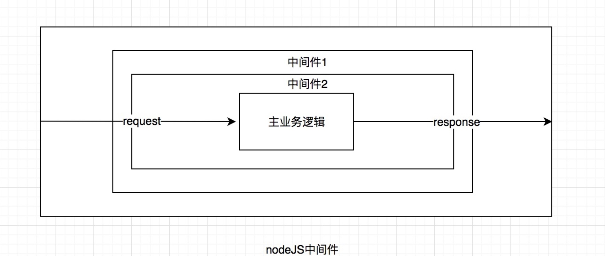

中间件是介于应用系统和系统软件之间的一类软件，它使用系统软件所提供的基础服务，衔接网络上应用系统的各个部分或者不同的应用，能够打到资源共享、功能共享的目的。

在NodeJS中,中间件主要指的是封装HTTP请求处理的方法，在实际的大型业务场景中，我们通常要对请求进行很多歩操作，譬如IP筛选，查询字符串传递、解析cookie，请求日志，以及权限校验、特定的业务逻辑等等处理。那么中间件的作用其实就是在请求进入具体的业务逻辑之前，经过特定的过滤器处理，如下图所示(下图来源于掘金社区，文章链接附在最后)



中间件的基本结构是这样的

```
const middleware = (req, res, next) => {
  // 请求处理逻辑
  next()
}
```
其中的next函数是将执行流程递交给下一个中间件。
中间件可以做很多事情，它可以更改请求对象和响应对象req和res，可以结束请求响应，也可以调用下一个中间件函数。如果没有下一个中间件并且请求没有被响应，那么这个请求将会被挂起。

### Express中间件

  Express是一个轻量级的、简洁的NodeJS web开发框架，提供了模板解析、静态文件服务、路由控制等功能，提供了以下几种类型的中间件

#### 应用级中间件

ß通过使用和函数将应用程序级中间件绑定到app对象的实例，其中是中间件函数以小写形式处理的请求的HTTP方法（例如GET，PUT或POST）。app.use()、app.METHOD()

举例

```
var app = express()
app.use(function (req, res, next) {
  console.log('Time:', Date.now())
  next()
})
```

#### 路由器级中间件

路由器级中间件的工作方式与应用程序级中间件的工作方式相同，但它绑定到的是一个实例express.Router()。

举例

```
var app = express()
var router = express.Router()

// 没有挂载路径的中间件功能。 对于路由器的每个请求都执行此代码
router.use(function (req, res, next) {
  console.log('Time:', Date.now())
  next()
})

router.use('/user/:id', function (req, res, next) {
  console.log('Request URL:', req.originalUrl)
  next()
}, function (req, res, next) {
  console.log('Request Type:', req.method)
  next()
})

// 初始化引入router中间件
app.use('/', router)
```

#### 错误处理中间件

  错误处理中间件总是需要四个参数。您必须提供四个参数以将其标识为错误处理中间件函数。即使您不需要使用该next对象，也必须指定它以保持签名。否则，该next对象将被解释为常规中间件，并且将无法处理错误。

```
app.use(function (err, req, res, next) {
  console.error(err.stack)
  res.status(500).send('Something broke!')
})
```

#### 内置中间件

从版本4.x开始，Express不再依赖于Connect。之前包含在Express中的中间件功能现在位于单独的模块中，常用的内置中间件有以下几种：

- express.static 提供静态资源，如HTML文件，图像等
- express.json 使用JSON有效负载解析传入的请求
- express.urlencoded 用URL编码的有效负载解析传入的请求

#### 第三方中间件

使用第三方中间件为Express应用程序添加功能。


### 参考文献

- [深入浅出nodejs中间件原理
](https://zhuanlan.zhihu.com/p/274325699)

- [Node.js + Express中间件详解
](https://juejin.cn/post/6905930211817324558)

