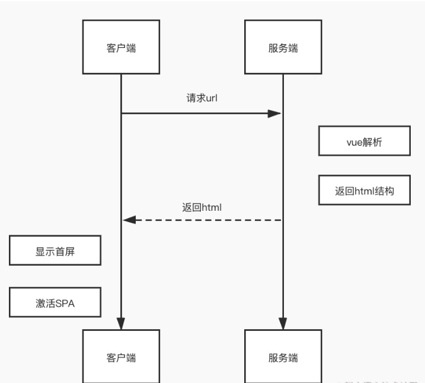

### 服务端渲染和客户端渲染
SSR(server side render)意为服务端渲染，在通常的使用Vue开发的项目中，都是属于CSR也就是客户端渲染的方式，客户端渲染的优势在于能够节省后端资源、局部更新页面，前后端分离，但它不好的地方在于，首屏渲染较慢，因为浏览器拿到的HTML文档中只有一个根节点\<div id="app">\</div>,页面结构是在JavaScript脚本加载之后，由js脚本动态创建，因此相比直接从服务端获取HTML直接交给浏览器进行渲染，首屏加载会更慢，同时由于HTML文档没有具体内容，因此不利于SEO。

而Vue SSR则更好的兼顾了这两种方式的优势，既能在前端使用Vue的模式进行开发，又保留了服务端渲染首屏加载快和对SEO更友好的特点。

### Vue SSR

#### SSR的实现


SSR的实现依然是使用webpack打包，主要要做的事情的服务端的首屏渲染和客户端的激活，需要生成一个服务器bundle文件用于服务端首屏渲染和一个客户端的bundle文件用于激活，下面贴一下这两个文件的简单实现

首先我们应该有一个main.js,负责创建Vue实例

```
import Vue from "vue";
import App from "./App.vue";
import { createRouter } from "./router";
// 导出Vue实例⼯⼚函数，为每次请求创建独⽴实例
// 上下⽂⽤于给vue实例传递参数
export function createApp(context) {
    const router = createRouter();
    const app = new Vue({
        router,
        context,
        render: h => h(App)
    });
    return { app, router };
```

服务端入口文件  src/entry-server.js

```
import { createApp } from "./main";
// 返回⼀个函数，接收请求上下⽂，返回创建的vue实例
export default context => {
    // 这⾥返回⼀个Promise，确保路由或组件准备就绪
    return new Promise((resolve, reject) => {
        const { app, router } = createApp(context);
        // 跳转到⾸屏的地址
        router.push(context.url);
        // 路由就绪，返回结果
        router.onReady(() => {
            resolve(app);
        }, reject);
    });
};

```

客户端入口文件,创建Vue实例并进行挂载，这一步称为激活。

```
import { createApp } from "./main";
// 创建vue、router实例
const { app, router } = createApp();
// 路由就绪，执⾏挂载
router.onReady(() => {
    app.$mount("#app");
});

```

以上是从官方demo中摘取的几个关键片段，完整实现参照官网[Vue SSR](https://cn.vuejs.org/v2/guide/ssr.html)
#### 简单总结
- 使用ssr不存在单例模式，每次用户请求都会创建一个新的vue实例
- 实现ssr需要实现服务端首屏渲染和客户端激活


#### 参考文献

- [SSR解决了什么问题](https://vue3js.cn/interview/vue/ssr.html#%E4%B8%80%E3%80%81%E6%98%AF%E4%BB%80%E4%B9%88)
- [Vue SSR 初探](https://juejin.cn/post/6896007907050487816)
