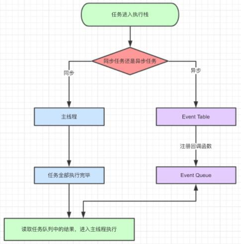

## Vue.nextTick的应用和实现原理

nextTick是Vue实例上的一个方法，它的作用是这样的
    
    在下次DOM更新循环结束之后执行延迟回调。在修改数据之后立即使用这个方法，获取更新后的DOM


具体的解释就是说Vue的DOM更新并不是在数据变化之后立即进行的，而是它会在数据变化之后开启一个异步更新的队列，需要等队列中所有的数据更新都完成之后，才会进行统一的更新。如果我们在一次事件循环中频繁修改同一个数据，它只会最后一次修改完成之后去更新DOM，最终呈现的结果是最后一次更新之后的结果。


### nextTick方法的实现

在解释nextTick方法的实现之前，需要先了解一下JavaScript的事件循环机制，这里简单介绍一下

#### JavaScript事件循环机制

首先，JavaScript设计之初就是一个单线程，也就是说同一时间只能做一件事情。那么当一件任务耗时比较久的时候，它后面所有的程序都会被阻塞。为了解决这种单线程阻塞的问题，JavaScript采用了事件循环机制，将JavaScript中所有的任务划分为同步任务和异步任务。

任务的执行过程是这样的，所有的同步任务会进入到主线程中形成一个执行栈，异步任务则会进入事件表格(event table)，当对应的异步事件执行完成之后，会将它的回调函数放入到事件队列(event queue)当中。当执行栈中的任务执行完成之后，会去检查当前的微任务队列去执行所有的微任务；微任务执行完成之后，再去检查宏任务队列，取一个宏任务出来执行，执行完毕之后再去检查微任务队列，如此循环，直到所有的任务执行完成。常见的宏任务包括setTimeout，setInterval，然后常见的微任务包括Promise.then，nextTick等。



#### nextTick实现

下面我们结合源码来说明一下nextTick的实现：

```
/* @flow */
/* globals MutationObserver */

import { noop } from 'shared/util'
import { handleError } from './error'
import { isIE, isIOS, isNative } from './env'

export let isUsingMicroTask = false

const callbacks = []
let pending = false

function flushCallbacks () {
  pending = false
  const copies = callbacks.slice(0)
  callbacks.length = 0
  for (let i = 0; i < copies.length; i++) {
    copies[i]()
  }
}

// Promise is available, we will use it:
/* istanbul ignore next, $flow-disable-line */
if (typeof Promise !== 'undefined' && isNative(Promise)) {
  const p = Promise.resolve()
  timerFunc = () => {
    p.then(flushCallbacks)
    // In problematic UIWebViews, Promise.then doesn't completely break, but
    // it can get stuck in a weird state where callbacks are pushed into the
    // microtask queue but the queue isn't being flushed, until the browser
    // needs to do some other work, e.g. handle a timer. Therefore we can
    // "force" the microtask queue to be flushed by adding an empty timer.
    if (isIOS) setTimeout(noop)
  }
  isUsingMicroTask = true
} else if (!isIE && typeof MutationObserver !== 'undefined' && (
  isNative(MutationObserver) ||
  // PhantomJS and iOS 7.x
  MutationObserver.toString() === '[object MutationObserverConstructor]'
)) {
  // Use MutationObserver where native Promise is not available,
  // e.g. PhantomJS, iOS7, Android 4.4
  // (#6466 MutationObserver is unreliable in IE11)
  let counter = 1
  const observer = new MutationObserver(flushCallbacks)
  const textNode = document.createTextNode(String(counter))
  observer.observe(textNode, {
    characterData: true
  })
  timerFunc = () => {
    counter = (counter + 1) % 2
    textNode.data = String(counter)
  }
  isUsingMicroTask = true
} else if (typeof setImmediate !== 'undefined' && isNative(setImmediate)) {
  // Fallback to setImmediate.
  // Technically it leverages the (macro) task queue,
  // but it is still a better choice than setTimeout.
  timerFunc = () => {
    setImmediate(flushCallbacks)
  }
} else {
  // Fallback to setTimeout.
  timerFunc = () => {
    setTimeout(flushCallbacks, 0)
  }
}

export function nextTick (cb?: Function, ctx?: Object) {
  let _resolve
  callbacks.push(() => {
    if (cb) {
      try {
        cb.call(ctx)
      } catch (e) {
        handleError(e, ctx, 'nextTick')
      }
    } else if (_resolve) {
      _resolve(ctx)
    }
  })
  if (!pending) {
    pending = true
    timerFunc()
  }
  // $flow-disable-line
  if (!cb && typeof Promise !== 'undefined') {
    return new Promise(resolve => {
      _resolve = resolve
    })
  }
}
```
这段源码位于src/core/util/next-tick.js文件，文件内容主要分为3个部分，
1. 接收callback放入callbacks中
2. 根据当前的浏览器环境选用对用的异步事件API 创建一个异步执行函数timerFun，选用的优先级如下
   
   - Promise.then
   - MutationObserver
   - setImmediate
   - setTimeout

3. 执行timerFun将callBacks注册进事件队列
4. 事件循环执行到对应的宏任务或者微任务时依次执行callbacks中的回调


### 参考文档
- [Vue源码系列-Vue中文社区](https://vue-js.com/learn-vue/instanceMethods/lifecycle.uehtml#_3-vm-nexttick)
- [Vue中的$nextTick有什么作用](https://github.com/febobo/web-interview/issues/14)
  
