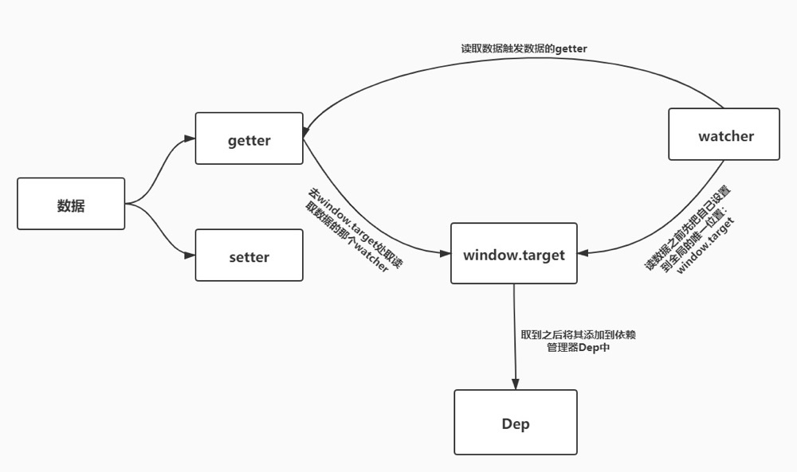

相比直接使用原生JavaScript操作DOM来完成页面交互，Vue最大的优势就在于它的数据驱动视图，也就是说当数据发生变化时，视图能够进行对应的更新，而不需要开发者在页面脚本中直接操作DOM，这使得前端开发的体验有了质的飞跃，那么，数据的变化是如何通知Vue的呢，这就是本文要讲述Vue数据响应式原理。

**注：本文是Vue2的响应式原理，Vue3的响应式原理会在日后的文章中更新**

### 数据变化侦测
要做到的数据变化之后能够及时更新视图，首先我们需要感知到数据的变化，在数据变化之后进行DOM的更新(当然这里实际上是虚拟DOM的更新，因为本文主要讲述数据响应式，所以在这里我们暂时将虚拟DOM以及后续的diff先弱化掉)。
在较为复杂的页面中，数据的变化有可能是用户操作触发，也可能是服务端数据变化造成页面上的数据更新，也就是说数据的更新不可能是由单一的操作引发的，所以我们不能在每一个更新数据的地方去过程式的更新DOM，而是要利用观察者模式去监听数据的变化，那么我们接下来就来讲述如何监听数据的变化，Vue中Object和Array的数据侦测方式是不一样的，所以我们分开讲述。
#### object的变化侦测

在JavaScript中，我们可以通过Object.defineProperty来拦截对象属性的读写操作，读取对象属性时会触发get,设置对象属性会触发set，我们可以通过定义属性时重写这两个handler来实时监听到数据的变化。
在Vue中，定义了一个Observer类来把一个对象变成可监测的对象。

```
// 源码位置：src/core/observer/index.js

/**
 * Observer类会通过递归的方式把一个对象的所有属性都转化成可观测对象
 */
export class Observer {
  constructor (value) {
    this.value = value
    // 给value新增一个__ob__属性，值为该value的Observer实例
    // 相当于为value打上标记，表示它已经被转化成响应式了，避免重复操作
    def(value,'__ob__',this)
    if (Array.isArray(value)) {
      // 当value为数组时的逻辑
      // ...
    } else {
      this.walk(value)
    }
  }

  walk (obj: Object) {
    const keys = Object.keys(obj)
    for (let i = 0; i < keys.length; i++) {
      defineReactive(obj, keys[i])
    }
  }
}
/**
 * 使一个对象转化成可观测对象
 * @param { Object } obj 对象
 * @param { String } key 对象的key
 * @param { Any } val 对象的某个key的值
 */
function defineReactive (obj,key,val) {
  // 如果只传了obj和key，那么val = obj[key]
  if (arguments.length === 2) {
    val = obj[key]
  }
  if(typeof val === 'object'){
      new Observer(val)
  }
  Object.defineProperty(obj, key, {
    enumerable: true,
    configurable: true,
    get(){
      console.log(`${key}属性被读取了`);
      return val;
    },
    set(newVal){
      if(val === newVal){
          return
      }
      console.log(`${key}属性被修改了`);
      val = newVal;
    }
  })
}
```

这段代码中定义了一个Observer类，用于将一个普通的object转换为可以监测的object,并且将Observer类的实例挂在原对象上面，表示它已经是一个响应式的值了，避免重复处理。

同时它会调用walk函数遍历对象的每一个属性，对每一个子属性进行递归的响应式处理，这样的话对象的每一级属性的读写都能够被检测到，这个object就变成了一个真正的响应式的object。

### 依赖收集

在上一部分讲完之后，我们已经知道了如何将一个对象变成响应式，那么，当我们监测到数据变化时，就需要去通知视图更新，那么，视图中一个数据可能在多个地方使用，那么我们怎么去通知这些地方呢？很容易想到的是，我们在访问数据时收集依赖，在数据更新时通知依赖更新。那么我们就需要一个数据结构来存储所有对数据的依赖，通常我们会用一个数组，为了方便管理，我们创建一个Dep的类来进行依赖的收集和管理。

```
  // 源码位置：src/core/observer/dep.js
export default class Dep {
  constructor () {
    this.subs = []
  }

  addSub (sub) {
    this.subs.push(sub)
  }
  // 删除一个依赖
  removeSub (sub) {
    remove(this.subs, sub)
  }
  // 添加一个依赖
  depend () {
    if (window.target) {
      this.addSub(window.target)
    }
  }
  // 通知所有依赖更新
  notify () {
    const subs = this.subs.slice()
    for (let i = 0, l = subs.length; i < l; i++) {
      subs[i].update()
    }
  }
}

/**
 * Remove an item from an array
 */
export function remove (arr, item) {
  if (arr.length) {
    const index = arr.indexOf(item)
    if (index > -1) {
      return arr.splice(index, 1)
    }
  }
}

```
在Dep类中，定义了一个subs数组用来存放依赖，并定义了相关方法对依赖进行增删以及通知等操作。通过这个依赖管理器，我们就可以在getter中收集依赖，在setter中通知依赖更新。

```
function defineReactive (obj,key,val) {
  if (arguments.length === 2) {
    val = obj[key]
  }
  if(typeof val === 'object'){
    new Observer(val)
  }
  const dep = new Dep()  //实例化一个依赖管理器，生成一个依赖管理数组dep
  Object.defineProperty(obj, key, {
    enumerable: true,
    configurable: true,
    get(){
      dep.depend()    // 在getter中收集依赖
      return val;
    },
    set(newVal){
      if(val === newVal){
          return
      }
      val = newVal;
      dep.notify()   // 在setter中通知依赖更新
    }
  })
}
```
在getter中收集依赖，在setter中通知依赖更新。

然后再来说一下收集的依赖具体是什么，他其实是另一个类的实例，这个类叫做watcher，我们先来看一下watcher类的实现

```
export default class Watcher {
  constructor (vm,expOrFn,cb) {
    this.vm = vm;
    this.cb = cb;
    this.getter = parsePath(expOrFn)
    this.value = this.get()
  }
  get () {
    window.target = this;
    const vm = this.vm
    let value = this.getter.call(vm, vm)
    window.target = undefined;
    return value
  }
  update () {
    const oldValue = this.value
    this.value = this.get()
    this.cb.call(this.vm, this.value, oldValue)
  }
}

/**
 * Parse simple path.
 * 把一个形如'data.a.b.c'的字符串路径所表示的值，从真实的data对象中取出来
 * 例如：
 * data = {a:{b:{c:2}}}
 * parsePath('a.b.c')(data)  // 2
 */
const bailRE = /[^\w.$]/
export function parsePath (path) {
  if (bailRE.test(path)) {
    return
  }
  const segments = path.split('.')
  return function (obj) {
    for (let i = 0; i < segments.length; i++) {
      if (!obj) return
      obj = obj[segments[i]]
    }
    return obj
  }
}
```
简单来说，watcher会将自己赋给一个全局变量window.target，然后访问一下自己使用到的那个数据，然后收集依赖的地方会在getter里将全局变量window.target放到依赖数组中，最后再将window.target还原。

整体的流程如图


### 参考文档：
[Vue源码系列-Vue中文社区](https://vue-js.com/learn-vue/reactive/object.html#_1-%E5%89%8D%E8%A8%80)
