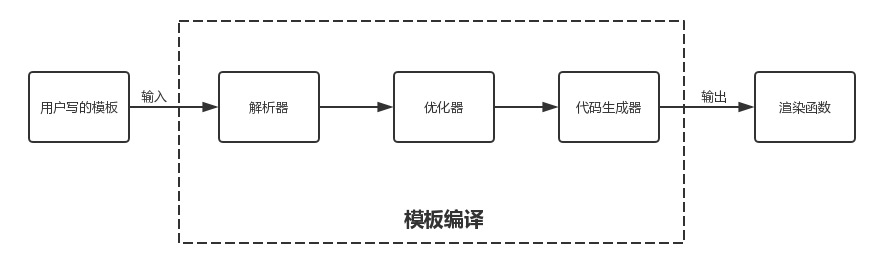
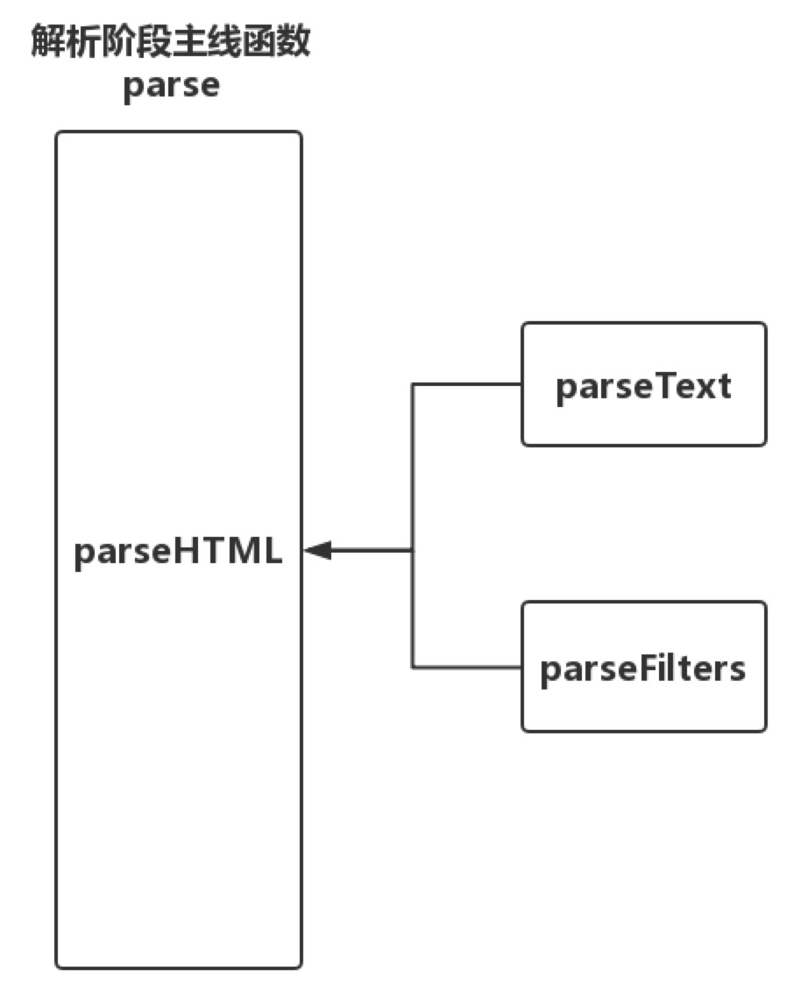

在之前的文章里，我们介绍了Vue中的虚拟DOM，我们知道虚拟DOM就是使用一个JavaScript对象去描述
DOM节点，那么虚拟DOM是如何产生的，这就是模板编译要做的事情。
### 综述
我们在进行Vue项目开发时，会将DOM结构以类HTML的语法写在<templete></templete>标签之内，而模板编译的过程就是解析这之间的类HTML语法的字符串，先通过正则等方式将其转换为AST语法树，然后经过一步优化，将其中的静态节点打上标签，最后将AST转换为render函数,主干逻辑如下：

```
// 源码位置: /src/complier/index.js

export const createCompiler = createCompilerCreator(function baseCompile (
  template: string,
  options: CompilerOptions
): CompiledResult {
  // 模板解析阶段：用正则等方式解析 template 模板中的指令、class、style等数据，形成AST
  const ast = parse(template.trim(), options)
  if (options.optimize !== false) {
    // 优化阶段：遍历AST，找出其中的静态节点，并打上标记；
    optimize(ast, options)
  }
  // 代码生成阶段：将AST转换成渲染函数；
  const code = generate(ast, options)
  return {
    ast,
    render: code.render,
    staticRenderFns: code.staticRenderFns
  }
})

```




### 模板解析过程
模板解析主要做的事情就是将<templete></templete>中间的内容解析为AST语法树，在Vue中这部分功能是由解析器parser模块来完成的。在模板中，除了有HTML标签以外，还有文本信息以及文本信息中包含的过滤器。不同的内容需要用不同的解析规则来做解析，因此除了HTML解析器以外，还有文本解析器和过滤器解析器。当然文本和过滤器都是在HTML标签之中的，因此整个解析过程中，HTML解析器是主干，解析过程中遇到了文本内容就调用文本解析器进行解析，遇到过滤器则调用过滤器解析器解析。


解析器的主干代码

```
// 代码位置：/src/complier/parser/index.js

/**
 * Convert HTML string to AST.
 */
export function parse(template, options) {
   // ...
  parseHTML(template, {
    warn,
    expectHTML: options.expectHTML,
    isUnaryTag: options.isUnaryTag,
    canBeLeftOpenTag: options.canBeLeftOpenTag,
    shouldDecodeNewlines: options.shouldDecodeNewlines,
    shouldDecodeNewlinesForHref: options.shouldDecodeNewlinesForHref,
    shouldKeepComment: options.comments,
    start (tag, attrs, unary) {

    },
    end () {

    },
    chars (text: string) {

    },
    comment (text: string) {

    }
  })
  return root
}
```
### HTML解析器

在上面的解析器主干代码中，我们会发现parse方法接收两个参数，一个是模板字符串，另一个则是进行转换时需要的一些选项，包含4个函数，这4个函数的作用就是在解析器解析到不同的内容时调用不同的钩子函数生成不同的AST：
- 当解析到开始标签时调用start函数生成函数类型的AST节点
- 解析到结束标签时调用end函数
- 解析到文本时调用chars函数生成文本类型的AST节点，这里如果解析到文本内容中包含了变量，则会将它解析为一个动态文本类型的AST节点，否则解析为静态文本类型的AST节点
- 解析到注释时调用comment函数生成注释类型的AST节点。

所以解析器的主要工作就是，一遍解析不同的内容一边生成对应的AST，最终将整个模板字符串转换成AST。

### 不同的内容的解析过程
1. 对于注释和条件注释以及文档类型DOCTYPE，都是相对简介明了的用正则去做匹配，这里就不展开讲述
2. 对于开始标签，也是通过正则表达式判断是否符合开始标签的条件，同时去匹配标签的标签名tag，属性attrs以及自闭合标识unary。标签属性的匹配是按照标签的标砖定义格式 attrname='aaaaaa'这种格式通过正则表达式进行匹配，匹配到一个属性之后将它从模板字符串中删除然后继续往后进行匹配，当所有的属性都匹配结束之后再判断剩下的标签内容是>还是/>判断是否是自闭合标签。
3. 对于结束标签，也是通过正则对其进行匹配，匹配成功之后调用end函数
4. 对于文本的解析，相对较为复杂，我们需要先解析第一个<出现的位置，如果<是第一个字符，那么说明模板字符串是其他几种类型开头的，否则就说明说明模板字符串是以文本开头的，那么从开头到第一个<出现的位置就都是文本内容了；如果在整个模板字符串里没有找到<，那说明整个模板字符串都是文本。但是这里有一种特殊情况就是<并不是开始或者结束标签的组成部分而是文本内容的一部分，那么就需要特殊判断了

```
let textEnd = html.indexOf('<')
// '<' 在第一个位置，为其余5种类型
if (textEnd === 0) {
    // ...
}
// '<' 不在第一个位置，文本开头
if (textEnd >= 0) {
    // 如果html字符串不是以'<'开头,说明'<'前面的都是纯文本，无需处理
    // 那就把'<'以后的内容拿出来赋给rest
    rest = html.slice(textEnd)
    while (
        !endTag.test(rest) &&
        !startTagOpen.test(rest) &&
        !comment.test(rest) &&
        !conditionalComment.test(rest)
    ) {
        // < in plain text, be forgiving and treat it as text
        /**
           * 用'<'以后的内容rest去匹配endTag、startTagOpen、comment、conditionalComment
           * 如果都匹配不上，表示'<'是属于文本本身的内容
           */
        // 在'<'之后查找是否还有'<'
        next = rest.indexOf('<', 1)
        // 如果没有了，表示'<'后面也是文本
        if (next < 0) break
        // 如果还有，表示'<'是文本中的一个字符
        textEnd += next
        // 那就把next之后的内容截出来继续下一轮循环匹配
        rest = html.slice(textEnd)
    }
    // '<'是结束标签的开始 ,说明从开始到'<'都是文本，截取出来
    text = html.substring(0, textEnd)
    advance(textEnd)
}
// 整个模板字符串里没有找到`<`,说明整个模板字符串都是文本
if (textEnd < 0) {
    text = html
    html = ''
}
// 把截取出来的text转化成textAST
if (options.chars && text) {
    options.chars(text)
}
```

在这里它将<后面的内容赋给了变量rest，匹配其他几种类型的正则，都匹配不上则说明这个<是文本本身的内容，然后如果有多个<，还要重复上面的判断。

最后需要说明一点的是，为了保证AST语法树的层级结构，用了一个栈结构来记录解析的结果，遇到开始标签时推入栈，遇到结束标签时出栈。


### 总结

在本文中，我们主要讲述了parser模块对HTML的解析，parser的主要功能是将模板字符串解析得到AST语法树，后续将AST语法树中的静态节点打上标签，相当于一步优化，最后利用AST语法树生成render函数，模板解析中除了HTML解析以外还有对文本内容的解析，这一部分我将在后续的文章中更新，敬请期待

### 参考文献

- [Vue源码系列-Vue中文社区](https://vue-js.com/learn-vue/complie/#_1-%E5%89%8D%E8%A8%80)
