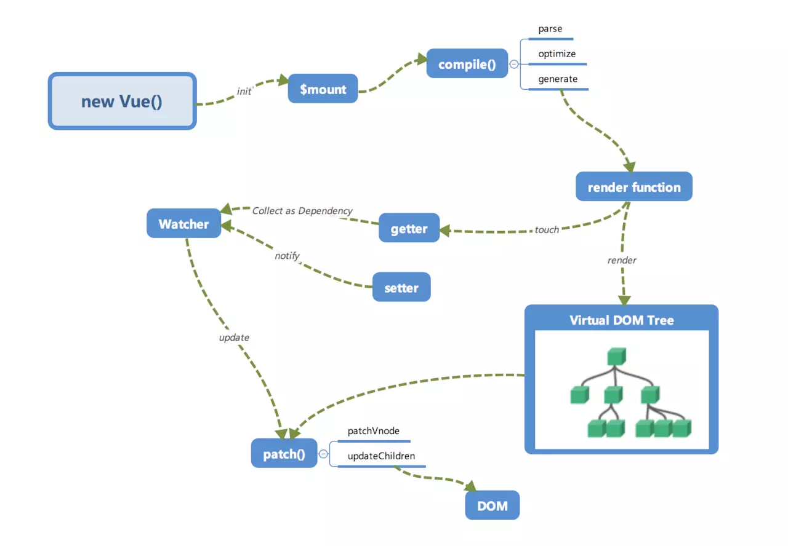

在这篇文章之前，写过几篇关于Vue响应式原理解析的的文章
- [Vue数据响应式原理](./Vue2%E6%95%B0%E6%8D%AE%E5%93%8D%E5%BA%94%E5%BC%8F.md)
- [Vue虚拟DOM简介](./Vue%E8%99%9A%E6%8B%9FDOM%E7%AE%80%E4%BB%8B.md)
- [Vue模板解析原理(上)](./Vue%E6%A8%A1%E6%9D%BF%E7%BC%96%E8%AF%91%E8%BF%87%E7%A8%8B%E5%92%8C%E5%8E%9F%E7%90%86.md)

这几篇文章各自从某一个角度介绍了Vue的实现细节，但是缺少一个全局整体的梳理，今天这篇文章的目的就是从头开始梳理一下Vue整体的运行流程，从初始化开始，完整介绍下模板编译和响应式系统建立的过程以及二者的相关性。

这张图中，展示了模板编译、虚拟DOM，依赖收集，数据更新机制等各个模块之间的关系，下面我们来按顺序分别介绍下各个模块的执行和彼此之间的关系

#### 初始化及挂载

在我们调用new Vue()进行实例化之后，Vue会调用_init函数进行初始化操作，在初始化的阶段它会初始化生命周期、事件、props、data、method、computed以及watcher等，在初始化的阶段，已经将数据进行了响应式处理。初始化的过程中，会在适当的时机调用beforeCreat和created两个生命周期钩子

在初始化阶段完成之后，调用$mount执行挂载

#### 挂载阶段

挂载阶段首先执行的就是模板编译，模板编译分成3个阶段，分别是

- parse阶段，使用正则等方式解析templete，生成AST
- optimize，标记静态节点，这是一步优化的步骤，后续diff时进行patch时，会直接跳过静态节点
- generate，将AST转换成render function字符串

下一步就是响应式系统的核心部分

上图是Vue官方的响应式系统的介绍图，当render function被渲染的时候，会读取对象的值，则会触发getter进行依赖收集，每一个组件对应了一个watcher实例，当getter被触发时，对应组件实例的watcher会将自己放在一个全局变量上面，后续进行的依赖收集会将全局变量记录的watcher放到Deps的subs中存储，这个就是依赖收集的过程。

#### 虚拟DOM
render function会被转换成VNode节点，虚拟DOM其实是用来完整描述真实DOM树的JavaScript对象，它其中包含了关于节点的全部信息。

梳理一下，在mount阶段主要做了以下几件事情

- 模板编译，生成 render function
- render function转换为虚拟DOM并进行渲染
- 在渲染时触发getter进行依赖收集

  mount开始之前会执行beforeMount钩子，挂载完成之后会执行mounted钩子

#### 视图更新

当数据发生变化时，触发setter通知watcher进行更新，此时会重新渲染render function生成新的虚拟DOM，与老的虚拟DOM进行patch，借助diff算法计算差异，进行视图更新，更新之前会执行update钩子函数，更新结束后会执行updated钩子函数。

#### 异步更新队列

Vue在更新DOM时是异步执行的，监听到数据变化时，将会开启一个队列，缓存所有在同一次事件循环中发生的数据变更，同一个watcher被重发触发时会进行去重，当数据更新发生后，组件并不会立即重新渲染，而是在下一个事件循环中进行更新，因此如果我们要在DOM更新之后执行一些动作，可以将其放在Vue.nextTick中。

### 参考文献
- [XXY BLOG: Vue.js 运行机制全局概览](https://xinxingyu.github.io/blog/blog/Vue/mechanism/a-overview.html#%E5%93%8D%E5%BA%94%E5%BC%8F)
- [Vue官方文档：深入响应式原理](https://cn.vuejs.org/v2/guide/reactivity.html)

