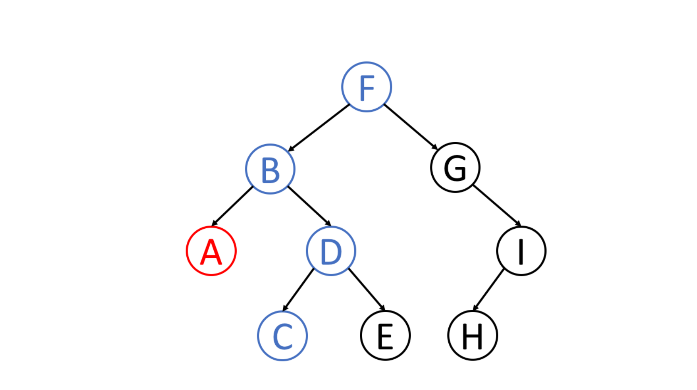

深度优先搜索(DFS)和广度优先搜索(BFS)是图的两种遍历的方式.为了简单的说明这个问题，我们举一种最特殊的图来说明这两种搜索方式，就是二叉树，树是图的一种特殊的形态。而二叉树又是树里面最特殊的一种，二叉树具备以下几个特点

- 每个节点都只有有限个子节点或无子节点；
- 没有父节点的节点称为根节点；
- 每一个非根节点有且只有一个父节点；
- 除了根节点外，每个子节点可以分为多个不相交的子树；
树里面没有环路(cycle)



### 二叉树的深度优先搜索
二叉树的深度优先遍历它其实就是从根节点开始，从根结点的左子树开始。一层一层的深入，一直深入到叶节点，然后再从叶节点开始回溯，回溯到某一存在不同分支的节点，沿着该节点的另一个节点往下逐层深入，一直到叶节点，然后再进行回溯，周而复始，最终遍历整个二叉树，下面再介绍一下二叉树的前序、中序、后序遍历，**这几种遍历方式都属于深度优先遍历**以上图中的这棵二叉树为例来解释一下这几种遍历的过程和结果。

在讲述之前，需要先明确一下，这里的前序、中序和后序遍历，都是指的父节点被访问的顺序，前序即先访问根节点，再访问左节点和右节点，中序、后序同理，左右子节点的访问顺序永远是先访问左节点后访问右节点。

#### 前序遍历
对上图中的二叉树前序遍历的过程是这样的
1. 先访问根节点F，然后访问根节点的左子树，先访问左子树的根节点B，然后再访问左子树的左子树A。
2. 此时已经到达叶节点，然后向前回溯，发现B有不同的分支，所以访问B的右子树，先访问B的右子树的根节点D，然后访问D的左子树C，然后再进行回溯，回溯到D再去访问D右子树E；
3. 最后向上回溯至根节点，访问根节点的右子树G，一直依次访问G->I->H,最终完成对整个二叉树的遍历，输出结果 F B A D C E G I H。

代码实现如下，这里放的是递归写法的代码

```
function preOrder (node) {
  if (node) {
    console.log(node.value);
    preOrder(node.left);
    preOrder(node.right);
  }
}
 
输出结果：F B A D C E G I H
```
   
#### 中序遍历
中序遍历过程是这样的
1. 先访问根节点的左子树B（这一步并不直接输出B，而是继续查看B有没有左子树），然后发现B节点还有子节点，于是先访问B节点的左节点A，然后回溯，B节点的左子树访问结束，于是访问根节点B，然后访问B的左子树
2. 访问到D的左子树发现D也有子树，于是访问D的左子树C，然后D的左子树访问结束，访问根节点D，然后再访问D的右节点E
3. 回溯至根节点，访问F，按照1,2的步骤完成对右子树的遍历，最终结果为 A B C D E F G I H

中序遍历的实现
```
// 中序遍历
function inOrder (node) {
  if (node) {
    inOrder(node.left);
    console.log(node.value);
    inOrder(node.right);
  }
}
 
输出结果 A B C D E F G H I
```

#### 后续遍历

后续遍历则是先访问左右子节点，再访问根节点，具体过程简述如下
1. 先访问左子树，如果左子树还有左子树，则递归访问左子树，
2. 到叶节点之后回溯，如果有右子树则先访问右子树，没有则访问根节点，最终完成树的遍历
   图中的树后续遍历最终输出的结果为 A C E D B H I G F

代码实现
```
// 后续遍历
function postOrder (node) {
  if (node) {
    postOrder(node.left);
    postOrder(node.right);
    console.log(node.value);
  }
}
 
输出结果： A C E D B H I G F
```

### 二叉树的的广度优先搜索

广度优先搜索相对好理解一些，即一层一层的访问二叉树，这里也不多做解释，leecode上有这一道原题，我直接把题目链接和作者写的解答贴在这里，供大家参考，这个题解用了队列来存放每一层的临时遍历结果，大家可以参考一下，建议自己尝试一下。

[二叉树层序遍历](https://leetcode.cn/problems/binary-tree-level-order-traversal/)

题解：

```
/**
 * Definition for a binary tree node.
 * function TreeNode(val, left, right) {
 *     this.val = (val===undefined ? 0 : val)
 *     this.left = (left===undefined ? null : left)
 *     this.right = (right===undefined ? null : right)
 * }
 */
/**
 * @param {TreeNode} root
 * @return {number[][]}
 */
var levelOrder = function(root) {
 if(!root) {
     return []
 }
 const queue = [root];
 const ans = [];
 while(queue.length) {
     const levelRes = [];
     const len = queue.length;
     for(let i = 0;i<len;i++) {
         const node = queue.shift();
         node && levelRes.push(node.val);
         if(node.left) {
             queue.push(node.left);
         }
         if(node.right) {
             queue.push(node.right);
         }
     }
     ans.push(levelRes)
 };
 return ans
};
```
