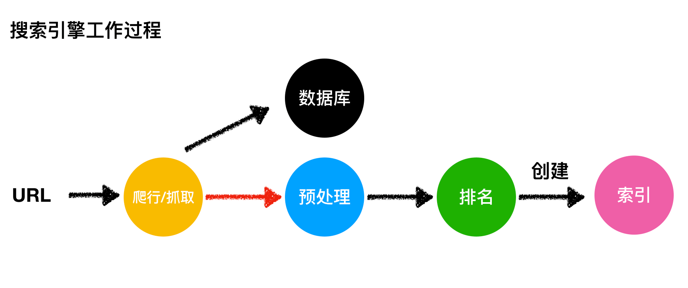

SEO全称是Search Engine Optimization，翻译为搜索引擎优化，指的是利用搜索引擎的规则提高网站在搜索引擎内的自然排名。目的是让其在行业内占据领先地位，获得品牌收益。

### 搜索引擎工作过程
搜索引擎工作的过程一般分为3个节点：爬取、预处理、排名:

1. 爬取，搜索蜘蛛通过跟踪链接访问页面，获取页面页面存入数据库
2. 预处理，对抓取到的页面内容进行文字提取、粉刺，索引等处理，备排名使用
3. 排名：用户搜索时，程序调用索引数据库，计算相关性，按一定格式生成搜索结果页

前端搜索引擎优化策略

- 合理的页面标题
- 使用语义化标签
    
    比如\<header>、\<h1>-\<h6>、<footer>\<article>、\<nav>、\<section>、\<aside>等
- 使用\<meta>原标签

  使用\<meta>中的keyword字段来提炼网站关键字，description字段来准确总结网页内容，但是不宜太过冗长
- 使用\标签alt属性

  alt属性是在图片加载异常的时候用来替代图片展示，同时它也能被蜘蛛抓取。

- 设置rel='nofollow'

设置rel='nofollow'可以通知蜘蛛忽略跟踪，避免不必要被跟踪的页面占用蜘蛛分配的比重，将网页权重分配给其他必要的链接

- HTML文档高质量和纯粹

避免在HTML中加载大量CSS和脚本，因为网页加载超时之后蜘蛛会放弃抓取

- 善用robots.txt文件
  
  robots.txt是存放在网站根目录下的文本文件，它用于告诉网络蜘蛛哪些内容可以抓取，哪些内容不可以抓取，因此善用robots.txt文件能够对搜索引擎优化起到一定作用。

### 参考文档
- [百度百科：搜索引擎优化 （搜索优化）](https://baike.baidu.com/item/%E6%90%9C%E7%B4%A2%E5%BC%95%E6%93%8E%E4%BC%98%E5%8C%96/3132)
- [前端搜索引擎优化--SEO](https://futu.im/article/2019-seo/)
