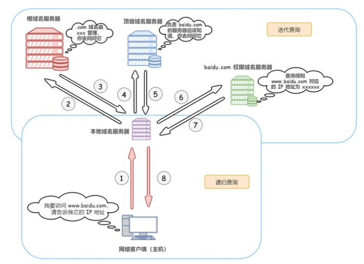
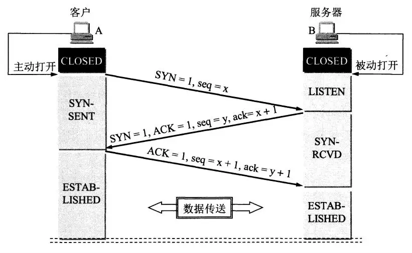

## 从输入URL到页面加载发生了什么

### 简单总结

先来概括性的回答一下这个问题，从浏览器地址栏输入URL分为以下几个阶段：
- DNS解析
- HTTP请求建连（三握手）
- HTTP请求传输
- 最后是浏览器拿到响应的内容之后对
- 浏览器解析渲染

然后来分阶段详细描述一下各个阶段发生了什么

### DNS解析
DNS解析的过程就是把用户输入的域名转换为对应的提供服务的网站的服务器的IP地址的过程，详细过程如图

- 浏览器会去查找自己本身的DNS缓存
- 查找操作系统的host文件
- 请求本地域名服务器
- 本地域名服务器请求根域名服务器
- 根域名服务器把顶级域名服务器的地址返回给本地域名服务器
- 本地域名服务器再去请求顶级域名服务器
- 顶级域名服务器把权限域名服务器的地址返回给本地域名服务器
- 本地服务域名服务器请求权限域名服务器，从权限域名服务器这里拿到对应的DNS信息返回。

**以上过程不是每次都会完整走一遍，如果在某一级已经查询到了对应的IP信息，就会直接返回，不会进行到下一步。**

### HTTP请求建连

HTTP请求建连的过程会经历三次握手，详细过程如图所示

- 第一次握手由客户端发起，它会向服务器发送一个带有SYN标识的一个请求包，同时会携带一个它自己的序列号seq=x;
- 服务器端接收这个请求包之后，会对这个请求包进行确认，他会给客户端发送一个SYN+ACK的一个包，同时携带自身的一个序列号seq=y，并且携带ack=x+1
- 客户端接收到这个SYN加ACK包之后，会再一次对服务器确认，它会再向服务器发送一个ACk的包,同时携带自身的序列号seq=x+1以及ack=y+1。
  
之所以要经历三次握手而不是两次，原因有两点
  - 握手的过程，其实是在让双方确认各自的发送和接收能力都正常。服务端第一次接收到客户端的请求包之后，可以确认客户端的发送能力以及自己的接收能力是正常的，第三次握手可以让服务端确认自身的发送和接收能力也是正常。
  - 两次握手的话, 客户端有可能因为网络阻塞等原因会发送多个请求报文，延时到达的请求又会与服务器建立连接，从而浪费掉许多服务器的资源

#### 浏览器渲染页面
- 解析HTML，构建DOM树
- 解析 CSS，生成CSS规则树
- 合并 DOM树和CSS规则，生成render树
- 布局 render 树（ Layout / reflow ），负责各元素尺寸、位置的计算
- 绘制 render 树（ paint ），绘制页面像素信息
浏览器会将各层的信息发送给 GPU，GPU 会将各层合成（ composite ），显示在屏幕上。

#### 总结
这个问题回答的时候可以很概括也可以很详细，每一步都有很多可以深挖的知识点，我暂且将我目前了解的这些总结一下，关于这个问题中的一些其他的细节点，还会持续探索。

#### 参考文献
[DNS协议 是什么？说说DNS 完整的查询过程?](https://github.com/febobo/web-interview/issues/141)
