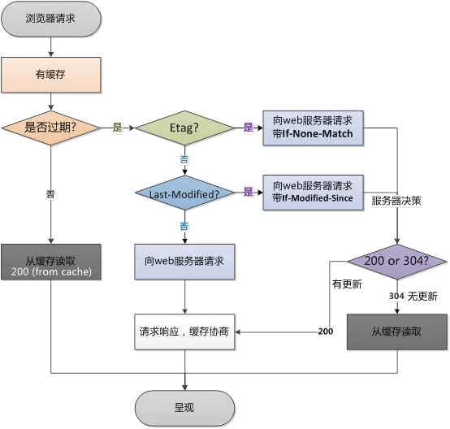

### 强制缓存和协商缓存

### Preface
在解释强制缓存和协商缓存之前，需要先铺垫一些简单的HTTP Headers相关的知识。

### HTTP Headers
 **HTTP Headers是指在超文本传输协议（HTTP）的请求和响应消息中的消息头部分，其中携带的字段定义了一个超文本传输协议事务中的操作参数。** 根据不同的上下文可以将消息头分为以下几个部分：
 - General headers(通用头): 同时适用于请求和响应消息，但与最终消息主体中传输的数据无关的消息头。
 - Request headers（请求头）: 包含更多有关要获取的资源或客户端本身信息的消息头。
 - Response headers（响应头）: 包含有关响应的补充信息，如其位置或服务器本身（名称和版本等）的消息头。
 - Entity headers: 包含有关实体主体的更多信息，比如主体长 (Content-Length) 度或其 MIME 类型。

今天着重介绍一下HTTP 头部中与缓存策略相关的字段，以下几个字段的使用也是区别强制缓存和协商缓存的关键。

### HTTP头部缓存字段
#### Cache-Control
Cache-Control是一个通用消息头字段，被用于在http请求和响应中，通过指定指令来实现缓存机制，常见的指令值有以下几种：
 - max-age=60000（示例） 设置缓存存储的最大时间，超过这个时间之后，缓存被认为过期 ，时间是相对于请求的时间
 - no-cache：不使用本地缓存。需要使用缓存协商，先与服务器确认返回的响应是否被更改，如果之前的响应中存在ETag，那么请求的时候会与服务端验证，如果资源未被更改，则可以避免重新下载。
 - no-store：直接禁止浏览器缓存数据，每次用户请求该资源，都会向服务器发送一个请求，每次都会下载完整的资源。
 - public：可以被所有的用户缓存，包括终端用户和CDN等中间代理服务器。
 - private：只能被终端用户的浏览器缓存，不允许CDN等中继缓存服务器对其缓存。
Cache-Control与Expires可以在服务端配置同时启用，同时启用的时候Cache-Control优先级高。
#### Expires
Expires是响应头中的一个绝对时间，它是一个的GMT格式的时间字符串，代表这个资源的失效时间，只要发送请求时间是在Expires之前，那么本地缓存始终有效，则在缓存中读取数据。所以这种方式有一个明显的缺点，由于失效的时间是一个绝对时间，所以当服务器与客户端时间偏差较大时，就会导致缓存混乱。如果同时出现Cache-Control:max-age和Expires，那么max-age优先级更高.
#### Etag
浏览器第一次请求一个资源的时候，服务端给予返回，并且在响应头中返回了ETag: "50b1c1d4f775c61:df3" 这样的字样给浏览器，它是一个资源的特定版本的标识符，当浏览器再次请求这个资源的时候，浏览器会将If-None-Match: W/"50b1c1d4f775c61:df3" 传输给服务端，服务端拿到该ETAG，对比资源是否发生变化，如果资源未发生改变，则返回304HTTP状态码，不返回具体的资源。
#### Etag和If-None-Match
Etag/If-None-Match返回的是一个校验码。ETag可以保证每一个资源是唯一的，资源变化都会导致ETag变化。服务器根据浏览器上送的If-None-Match值来判断是否命中缓存。与Last-Modified不一样的是，当服务器返回304 NotModified的响应时，由于ETag重新生成过，response header中还会把这个ETag返回，即使这个ETag跟之前的没有变化。
#### Last-Modify/If-Modify-Since
浏览器第一次请求一个资源的时候，服务器返回的header中会加上Last-Modify，Last-modify是一个时间标识该资源的最后修改时间，例如Last-Modify: Thu,31 Dec 2037 23:59:59 GMT。
当浏览器再次请求该资源时，request的请求头中会包含If-Modify-Since，该值为缓存之前返回的Last-Modify。服务器收到If-Modify-Since后，根据资源的最后修改时间判断是否命中缓存。
如果命中缓存，则返回304，并且不会返回资源内容，并且不会返回Last-Modify。

### 浏览器缓存策略

浏览器缓存策略如图：

图中由过期时间决定是否使用缓存的部分称为强制缓存，而使用Etag/If-None-Match和Last-Modify/If-Modify-Since，由服务器决定缓存是否可用的缓存策略称之为协商缓存，
二者主要区别在于：

** 强制缓存是利用http头中的Expires和Cache-Control两个字段来控制的，用来表示资源的缓存时间，协商缓存由服务器来确定缓存资源是否可用，客户端与服务器端要通过某种标识来进行通信，从而让服务器判断请求资源是否可以缓存访问。 **

### 参考文献
- [Cache-Control](https://developer.mozilla.org/zh-CN/docs/Web/HTTP/Headers/Cache-Control)
- [维基百科：HTTP头字段](https://zh.wikipedia.org/wiki/HTTP%E5%A4%B4%E5%AD%97%E6%AE%B5)
- [Expires](https://developer.mozilla.org/zh-CN/docs/Web/HTTP/Headers/Expires)
- [http面试必会的：强制缓存和协商缓存
](https://juejin.cn/post/6844903838768431118)
  
