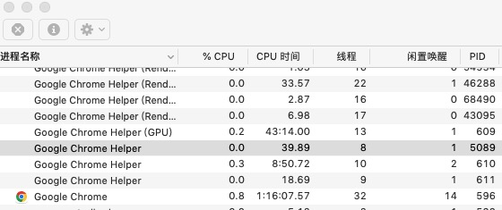
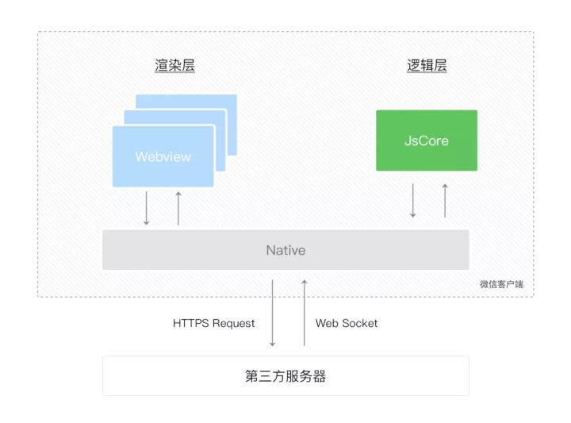

在说小程序的双线程模型之前，先简单介绍一下进程和线程

### 进程和线程
**进程**是对运行时程序的封装，是系统进行资源调度和分配的的基本单位，实现了操作系统的并发；

**线程**是进程的子任务，是CPU调度和分派的基本单位，用于保证程序的实时性，实现进程内部的并发；线程是操作系统可识别的最小执行和调度单位。**进程由单个或多个线程组成。**

一个线程只能属于一个进程，而一个进程可以有多个线程；

进程是资源分配的最小单位，线程是CPU调度的最小单位。

### 浏览器的多线程模型
打开电脑的活动监视器，可以看到Chrome浏览器的进程运行情况

从图中可以看到，Chrome上有多个进程，包括多个标签页进程和通用的浏览器进程和GPU进程等。每个标签页有一个独立的渲染进程，这样设计保证了不同进程之间资源和行为的独立，就是说即时某一个标签页崩溃也不会影响其他的标签页，而每个标签页进程中又包含了以下几个进程分工完成各项工作
- GUI线程：负责将文档内容渲染为可视化UI
- JavaScript引擎线程：负责解析和运行JavaScript逻辑代码
- 定时触发器线程：负责处理setTimeout/setInterval 定时器
- 异步http请求线程：处理XHR异步请求，比如回调函数注册进事件队列
- 事件触发线程：主要用来控制事件循环

**浏览器JavaScript引擎线程和GUI渲染线程是互斥的**，js执行时会阻塞UI渲染，甚至执行时间太长会造成页面卡死。**但这并不代表浏览器是单线程的。**

### 微信小程序的双线程模型
小程序与浏览器不同，小程序是双线程模型，渲染层使用Webview作为渲染载体，一个页面是一个WebView,所以渲染层会有多个WebView。
逻辑层则使用JavaScript引擎解析和执行JS逻辑代码。渲染层和逻辑层分别由两个线程进行管理，而在不同运行环境中，使用的渲染引擎和JavaScript引擎也不尽相同。

| 运行环境  | 渲染引擎 | JavaScript引擎 |
| ------- | ------- | ------|
| Android | Chromium定制内核| V8    |
| IOS   | WKWebview       | JSCore |
| 微信开发者工具| Chrome WbbView|NWJS|

#### 逻辑层与渲染层之间的通信
小程序运行时，逻辑层执行JavaScript逻辑代码，将数据通过调用setData函数传递到渲染层，渲染层通过WXML、WXSS的内容结合传递过来的数据完成页面UI的渲染。而setData函数的背后并不是只有一句话这么简单。

两个线程的通信是基于微信客户端提供的WeixinJsBridge来实现的，顾名思义它是一个桥梁，将小程序的运行环境和微信客户端(native连接了起来)，同时也负责在渲染进程和逻辑进程之间传递数据和事件的工作。

数据传输通过逻辑层和视图层两边提供的evaluateJavascript实现的，用户传输的数据，需要将其转换为字符串形式传递，同时把转换后的数据内容拼接成一份 JS 脚本，再通过执行 JS 脚本的形式传递到两边的独立环境。

除了连接渲染进程和逻辑进程，微信小程序的请求也是通过WeixinJsBridge由微信客户端代为发起。

#### 双线程模型的优缺点
- 双线程模型的优势在于提供了相对封闭和安全的运行环境，将逻辑层和渲染层隔离开，用户无法直接操作DOM，具有更高的安全性。
- 缺点在于每一次数据传递都要进行一次线程之间的通信，当数据更新频繁或者传递数据量较大时会难以避免的出现性能问题。
  

### 参考文档
- [进程和线程的概念、区别及进程线程间通信](https://cloud.tencent.com/developer/article/1688297)
- [小程序双线程模型](https://juejin.cn/post/6930897871529213966)
- [微信小程序的架构以及为什么要用到双线程](https://juejin.cn/post/6923912179544489991)
