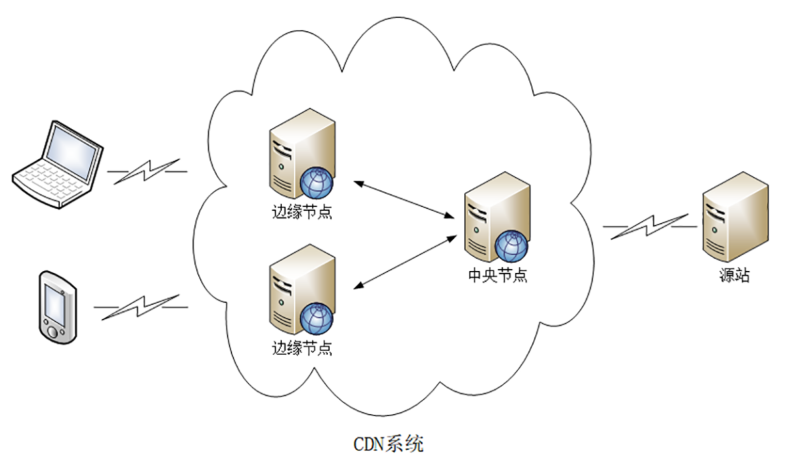

CDN指的是内容分发网络，它依靠部署在各地的边缘服务器，通过中心平台的负载均衡，内容分发，调度等功能模块，是的用于就近获取需要的资源，降低网络堵塞，提高访问速度和命中率。

### 原理浅析
在我们之前的题解中，讲过从浏览器输入URL到页面渲染发生了什么，我们知道一个请求发出来会先经过DNS解析，拿到目标服务器的IP然后获取资源，而在使用了CDN之后，CDN会在域名解析过程中承担一个中间人的角色，它返回的不是IP地址，而是CNAME别名记录，指向CDN的负载均衡。

#### 负载均衡系统

本地DNS向CDN的全局负载均衡系统进行智能调度的时候，会基于以下几点综合判定
- 查看用户的IP地址，查表得知地理位置，找到相对最近的边缘节点
- 看用户所在的运营商网络，找相同网络的边缘节点
- 检查边缘节点的负载情况，找到负载较轻的节点
- 其他还会考虑节点的“健康状况”、服务能力、带宽等等

综合以上几点考虑，将最合适的CDN节点的地址返回给客户端。
#### 缓存代理

CDN缓存系统会有选择的缓存最常用的资源，有两个衡量的指标：
- 命中率：用户访问的资源正好在缓存系统里，可以直接返回用户，命中次数和请求次数的比值
- 回源率：缓存没有，必须回源站获取，回源次数和所有访问次数的比值

缓存系统也可以划分出层次，分成一级缓存节点和二级缓存节点。一级缓存配置高一些，直连源站，二级缓存配置低一些，直连用户

回源的时候二级缓存只找一级缓存，一级缓存没有才回源站，可以有效地减少真正的回源。
### 参考文档：

- [面试官：如何理解CDN？说说实现原理？ #142
](https://github.com/febobo/web-interview/issues/142)
