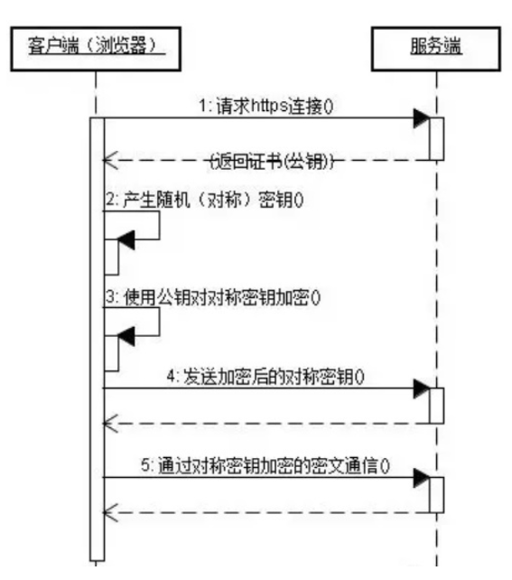

HTTP和HTTPS都是属于计算机网络模型中应用层的协议，关于计算机网络模型的介绍可以看这里[OSI七层模型](./OSI%E4%B8%83%E5%B1%82%E6%A8%A1%E5%9E%8B.md)
HTTP和HTTPS常被用于在客户端和服务端传递数据，它们属于应用层，传递的数据内容并不是二进制流，而是具体的资源内容，比如HTML文档，图片等。

### HTTP
HTTP是以明文进行传输的，没有任何加密，具有以下几个特点：
- 支持客户端/服务端模式
- 通信方式简单，建连的时候经历三次握手，只需要传送请求方式和路径，通信速度快
- 灵活，可以支持传输各种类型的数据对象，由header中的content-type来指定
- 无连接，一次连接只处理一次请求，请求后马上端开连接
- 无状态，上一次连接的状态不会影响下一次连接

### HTTPS

正是由于HTTP是明文传输的，这并不安全，于是便有了HTTPS协议

HTTPS = HTTP + SSL/TLS，通过SSL证书来验证服务器身份，对客户端和服务器之间的通信进行加密。

HTTPS协议的工作流程如图

- 客户端访问服务器建立SSL连接
- 服务端收到请求，将网站支持的证书信息返回给客户端，包含公钥
- 客户端与服务器协商SSL连接安全等级
- 客户端根据双方商定的安全等级，生成会话秘钥，利用公钥将会话密钥加密传送给网站
- 服务器利用私钥解密得出会话密钥
- 服务器利用会话密钥和客户端通信

### 区别

- 显而易见，HTTPS更安全
- HTTP默认端口 80，HTTPS默认端口443
- HTTPS多了加密过程，性能不如HTTP
- HTTPS需要SSL，SSL证书需要一定的费用

### 参考文档

- [HTTP与HTTPS的区别](https://www.cnblogs.com/klb561/p/10289199.html)
