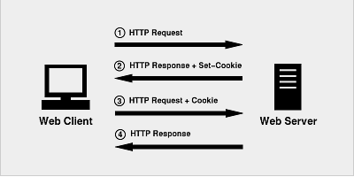

在web开发中，我们通常使用HTTP来作为请求协议，而HTTP是一个无状态的协议，也就是说我们无法感知到两次请求是否来自同一个用户，那么当我们需要感知用户的状态时，就需要一种机制来识别某个具体的用户，这个机制就是session，通常它的实现是这样的

- 首先客户端发送一个请求到服务端
- 服务端接受请求后，生成一个session，通过某种介质保存下来，同时发送一个HTTP响应给客户端，在响应头中包含Set-cookie头部，将sessionId设置到cookie中
- 下次浏览器再向同一域名下的服务器发起请求，会自动带上cookie信息
- 服务器收到cookie信息会对其进行分解验证，核对成功之后进行响应。
  
流程如下图所示

几点需要注意的问题

- cookie只是实现session的一种方法，也是最常用的一种，但也并非唯一的一种，禁用cookie之后还可以通过其他比如将sessionId放在URl中来实现session机制
- 现在大多都是Session + Cookie，但是只用session不用cookie，或是只用cookie，不用session在理论上都可以保持会话状态。可是实际中因为多种原因，一般不会单独使用
- 用session只需要在客户端保存一个id，实际上大量数据都是保存在服务端。如果全部用cookie，数据量大的时候客户端是没有那么多空间的。
- 如果只用cookie不用session，那么账户信息全部保存在客户端，一旦被劫持，全部信息都会泄露。并且客户端数据量变大，网络传输的数据量也会变大

#### 参考文献

- [彻底弄懂session，cookie，token](https://segmentfault.com/a/1190000017831088)
