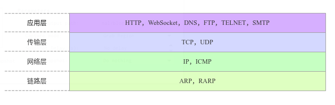

websocket是HTML5提供的一种浏览器与服务器进行全双工通信的网络技术，使得浏览器具备了实时双向通信的能力
这篇文章从websocket协议和H5中的websocket API两个方面介绍一下websocket

### WebSocket API

#### 客户端API

Websocket是一个构造函数，用于创建Websocket实例

```javascript
const ws = new WebSocket('ws://localhost:8080');
```

Websocket对象的属性和方法

- readyState： 当前Websocket实例的连接状态，是一个只读属性，有以下几种状态
  - 0 connecting 正在连接中
  - 1 open  已经连接并且可以通讯
  - 2 closing 连接正在关闭中
  - 3 losed  连接已经关闭或者没有连接成功
- send  向服务端发送数据
- bufferAmount 返回没有发送出去的二进制数据的数量，用于判断发送是否已经结束
- onopen 连接成功之后的回调函数
- onclose 连接关闭之后的回调
- onmessage 客户端接受到服务端消息之后的回调函数
- onerror 报错之后的回调函数


### 简单配置实例

实例中我们使用Nodejs作为Websocket服务端，NodeJS本身没有提供Websocket的支持，使用Websocket需要依赖第三方包，ws是比较常用的一个。node端配置如下：

```JavaScript

var app = require('express')();
var server = require('http').Server(app);
var WebSocket = require('ws');
 
var wss = new WebSocket.Server({ port: 8080 });
 
wss.on('connection', function connection(ws) {
    console.log('server: receive connection.');
     
    ws.on('message', function incoming(message) {
        console.log('server: received: %s', message);
    });
 
    ws.send('world');
});
 
app.get('/', function (req, res) {
  res.sendfile(__dirname + '/index.html');
});
 
app.listen(3000);

```

客户端配置

```JavaScript
<script>
  var ws = new WebSocket('ws://localhost:8080');
  ws.onopen = function () {
    console.log('ws onopen');
    ws.send('from client: hello');
  };
  ws.onmessage = function (e) {
    console.log('ws onmessage');
    console.log('from server: ' + e.data);
  };
</script>
```

### Websocket协议



Websocket是基于TCP的应用层协议，用于在客户端和服务端之间实现双向通信

#### 建连过程

1. 客户端向Websocket服务端发起一个HTTP请求协商升级协议，得到服务端响应，协议升级成功之后后续的数据交互遵循Websocket协议，本次请求协议头部有几个关键字段

- Connection: Upgrade 表示要升级协议
- Upgrade: websocket 表示要升级为Websocket协议
- Sec-Websocket-Version:13 表示Websocket版本，如果服务端不支持该版本，需要返回一个Sec-WebSocket-Versionheader，里面包含了服务端支持的版本号
- Sec-WebSocket-Key：客户端生成的一组base64编码的随机数，用于标识本次连接

2. 服务端响应协议升级
- Connection：Upgrade
- Upgrade：websocket
- Sec-WebSocket-Accept:根据客户端传过来的Sec-WebSocket-Key计算出来的

3. Sec-WebSocket-Key/Sec-WebSocket-Accept的作用

- 避免服务端收到非法的websocket连接
- 确保服务端理解websocket连接。因为ws握手阶段采用的是http协议，因此可能ws连接是被一个http服务器处理并返回的，
此时客户端可以通过Sec-WebSocket-Key来确保服务端认识ws协议。

