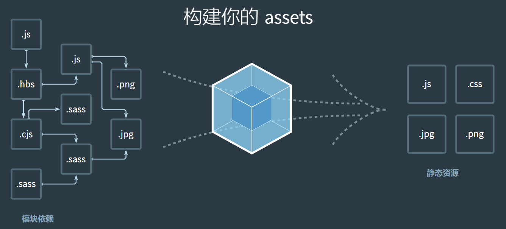

loader指的是加载器，用于在webpack打包的时候将不同类型的文件识别为webpack可识别的模块，用来处理css、less、scss、图片等资源文件。

webpack只能直接JavaScript代码，因此任何非JavaScript代码都必须要预先处理转换为JavaScript脚本之后参与打包，这就是loader要完成的工作
下图是webpack的工作流程：


当遇到非JavaScript的模块时，需要用对应的loader进行处理。

### loader配置方式

loader有三种配置方式

- 配置文件中声明：在webpack.config.js中声明
- 内联方式：在每个import语句中指定loader
- cli方式：在shell命令中指定

常见的loader配置写法

```
module.exports = {
  module: {
    rules: [
      {
        test: /\.css$/,
        use: [
          { loader: 'style-loader' },
          {
            loader: 'css-loader',
            options: {
              modules: true
            }
          },
          { loader: 'sass-loader' }
        ]
      }
    ]
  }
};
```

### loader特性

- loader可以是同步的，也可以是异步的
- loader运行在Node.js中，能执行任何操作
- loader能够产生额外的任意文件

### 常见loader

- babel-loader: 将ES6转成ES5
- style-loader: 将CSS添加到DOM style标签里
- css-loader:允许将css文件通过require的方式引入，并返回css代码
- less-loader、sass-loader: 处理less、sass
- file-loader: 分发文件到output目录并返回相对路径
- url-loafer: 和file-loader类似，但是当文件小于设定的limit时可以返回一个Data Url

### 以css—loader为例说明loader配置

```
rules: [
  ...,
 {
  test: /\.css$/,
    use: {
      loader: "css-loader",
      options: {
     // 启用/禁用 url() 处理
     url: true,
     // 启用/禁用 @import 处理
     import: true,
        // 启用/禁用 Sourcemap
        sourceMap: false
      }
    }
 }
]
```


### 参考文献
- [面试官：说说webpack中常见的Loader？解决了什么问题？](https://github.com/febobo/web-interview/issues/123)
