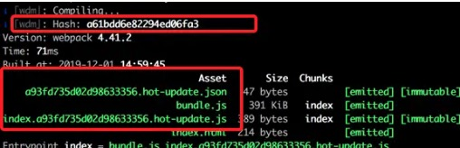

Hot Module Replacement，简称HMR，在不需要刷新整个页面的同时更新模块，能够提升开发的效率和体验。热更新时只会局部刷新页面上发生了变化的模块，同时可以保留当前页面的状态，比如复选框的选中状态等。

### webpack的构建编译过程

在使用webpack构建的项目中，当我们进行构建打包时，控制台会输出其构建的过程


每次重新编辑保存之后会自动重新编译，会重新生成新的hash值和对应的json文件



hash值代表每一次编译的标识，上次编译生成的hash值会作为本次编译新生成的文件标识，本次生成的hash值作为下次热更新的标识。

每次修改代码，重新编译之后，浏览器会发出两次请求，请求本次生成的两个新文件，json文件中返回的h字段标识本次生成的hash值，c则标识要热更新对应的模块。

### 热更新的实现

webpack-dev-server启动的时候会做三件事情

1. 启动webpack，生成compiler实例，compiler实例的功能很多，比如用来启动webpack的编译工作，监听文件变化等。
2. 使用Express启动一个本地服务，使得浏览器可以访问本地服务
3. 启动websocket服务，用于浏览器和本地node服务进行通讯。

#### 监听文件变化

webpack监听文件变化主要是通过webpack-dev-middleware这个库来完成，它负责本地文件的编译、输出和监听，

webpack-dev-middleware中执行了compiler.watch方法，它主要做了两件事情

1. 对本地文件编译打包
2. 编译结束之后，开启监听，文件发生变化时重新编译，并持续进行监听

#### 监听webpack编译结束

setupHooks方法用来注册监听事件，当监听到webpack编译结束时，通过websocket给浏览器发通知，浏览器拿到hash只之后就可以做检查更新逻辑。

#### 浏览器的热更新逻辑
当我们配置了热更新之后，打包生成的bundle文件不会真实生成并输出到dist目录下，而是在内存里，这个是基于memory-fs这个模块来实现的

而浏览器的热更新逻辑，则是利用HotModuleReplacementPlugin这个插件来实现的，当我们配置了热更新时，打包出来的模块就多了一个hot属性，而热更新的检查逻辑就是moudle.hot.check这个方法来实现的。热更新的核心逻辑在hotApply这个方法中，它完成的工作入选

1. 删除过期模块，即需要替换的模块

```
var queue = outdatedModules.slice();
while (queue.length > 0) {
    moduleId = queue.pop();
    // 从缓存中删除过期的模块
    module = installedModules[moduleId];
    // 删除过期的依赖
    delete outdatedDependencies[moduleId];
    
    // 存储了被删掉的模块id，便于更新代码
    outdatedSelfAcceptedModules.push({
        module: moduleId
    });
}

```
2. 将新的模块添加到 modules 中

```
appliedUpdate[moduleId] = hotUpdate[moduleId];
for (moduleId in appliedUpdate) {
    if (Object.prototype.hasOwnProperty.call(appliedUpdate, moduleId)) {
        modules[moduleId] = appliedUpdate[moduleId];
    }
}
```
3. 通过__webpack_require__执行相关模块的代码

```
for (i = 0; i < outdatedSelfAcceptedModules.length; i++) {
    var item = outdatedSelfAcceptedModules[i];
    moduleId = item.module;
    try {
        // 执行最新的代码
        __webpack_require__(moduleId);
    } catch (err) {
        // ...容错处理
    }
}

```

### 总结
以上内容是对webpack热更新原理的简单描述，忽略了很多细节的实现，更详细的实现可以参考下面列的这篇文章，我认为作者写的非常好
[轻松理解webpack热更新原理
](https://juejin.cn/post/6844904008432222215)
### 参考文献

- [轻松理解webpack热更新原理
](https://juejin.cn/post/6844904008432222215)
